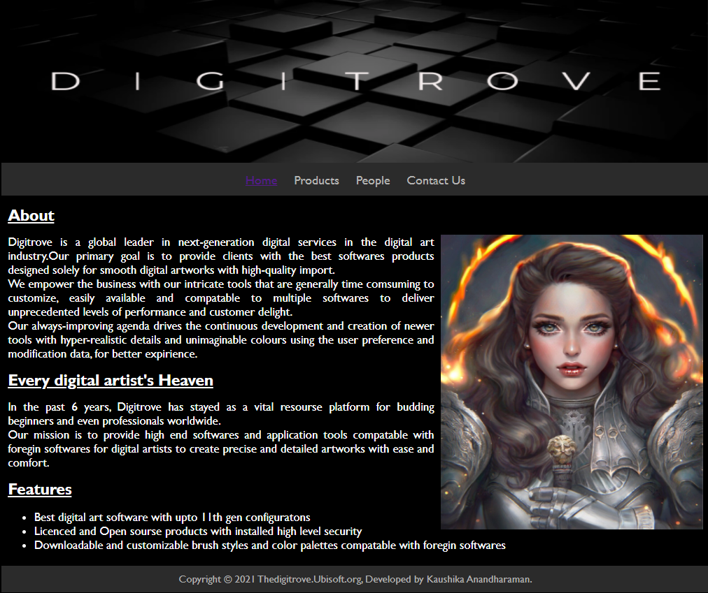
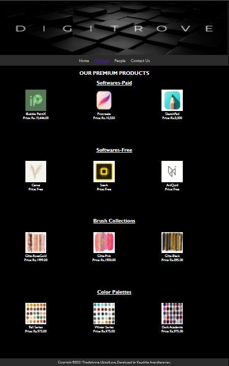
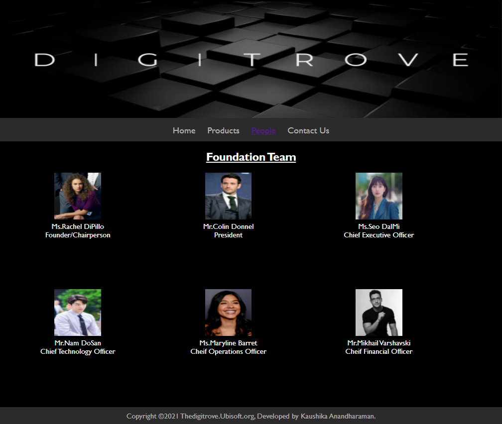
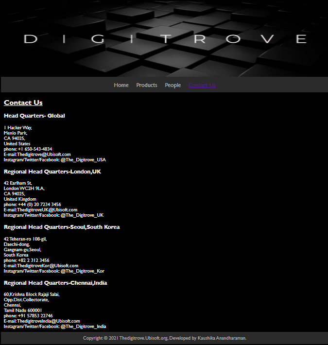

# Web Design for a Software Product Company

## AIM:

To design a static website for a software product company company.

## DESIGN STEPS:

### Step 1:

Requirement collection.

### Step 2:

Creating the layout using HTML and CSS.

### Step 3:

Updating the sample content.

### Step 4:

Choose the appropriate style and color scheme.

### Step 5:

Validate the layout in various browsers.

### Step 6:

Validate the HTML code.

### Step 6:

Publish the website in the given URL.

## PROGRAM :
## CSS StyleSheet
~~~
* {
  box-sizing: border-box;
  font-family:'Gill Sans', 'Gill Sans MT', Calibri, 'Trebuchet MS', sans-serif ;
}
body{
    background-color: black;
    color: white;
}
.container {
  width: 1080px;
  margin-left: auto;
  margin-right: auto;
  border-width: 1px 1px 1px 1px;
  border-style: hidden;
}

.banner {
  display: block;
  width: 100%;
  height: 250px;
  text-align: center;
  font-size: 60px;
  background-image: url("/static/img/adobe.png");
  background-size: 100% 100%;
  margin: 0px 0px 0px 0px;
  padding-top: 150px;
  color: white;
  font-family: 'Gill Sans', 'Gill Sans MT', Calibri, 'Trebuchet MS', sans-serif;
}

.menu {
  display: block;
  width: 100%;
  height: 50px;
  font-size: larger;
  background-color: #2B2B2B;
  text-align: center;
  padding-top: 15px;
  margin: 0px 0px 0px 0px;
  border-width: 1px;
}

.menuitem {
  display: inline-block;
  margin-left: 10px;
  margin-right: 10px;
}
.menuitemselected {
  display: inline-block;
  margin-left: 10px;
  margin-right: 10px;
  color:rgb(180, 180, 179);
}

.menuitem a {
  text-decoration: dotted;
  color: rgb(180, 180, 179);
}

.content {
  display: block;
  width: 100%;
  min-height: 550px;
  margin: 0px 0px 0px 0px;
  border-width: 1px;
  border-style:hidden;
}
.homecontent {
  min-height: 500px;
  margin: 10px 10px 10px 10px;
}
.homecontent h1 {
  text-align:justify;
  font-size: x-large;
}
.heading2{
  text-align:center;
}
.homecontent img {
  float: right;
  width: 400px;
  height: 450px;
  margin-left: 10px;
}

.contenttext {
  text-align: justify;
  font-family: 'Gill Sans', 'Gill Sans MT', Calibri, 'Trebuchet MS', sans-serif;
  font-size:large;
}

.footer {
  display: block;
  width: 100%;
  height: 40px;
  background-color: #2B2B2B;
  text-align: center;
  padding-top: 10px;
  margin: 0px 0px 0px 0px;
  color: rgb(180, 180, 179);
}
.productcontent {
  min-height: 500px;
  margin: 10px 10px 10px 10px;
}

.productcontent h1 {
  text-align: left;
}

.productitems {
  display: block;
}

.productitem {
  display: inline-block;
  width: 30%;
  height: 250px;
  text-align: center;
}

.productitem img {
  width: 100px;
  height: 100px;
  display: block;
}
.productitem .itemimage {
  display: block;
  margin-left: auto;
  margin-right: auto;
  width: 100px;
  margin-bottom: 5px;
}

.productitem .itemname {
  display: block;
}
.productitem .itemprice {
  display: block;
}

.peoplecontent{
  min-height: 500px;
  margin: 10px 10px 10px 10px;
}

.peoplecontent h1{
  text-align: left;
}

.peoplepics{
  display: block;
}

.peoplepic{
  display: inline-block;
  width: 30%;
  height: 250px;
  text-align: center;
}

.peoplepic img{
  width: 100px;
  height: 100px;
  display: block;
}

.peoplepic .peopleimage{
  display: block;
  margin-left: auto;
  margin-right: auto;
  width: 100px;
  margin-bottom: 5px;
}

.peoplepic .peoplename{
  display: block;
}

.peoplepic .peopledes{
  display: block;
}

.contactcontent{
  min-height: 500px;
  margin: 10px 10px 10px 10px;  
}

.contactitems{
  display: block;
}

.contactitem{
  display:block;
  text-align: left;
}

.contactitem .address{
  display: block;
  text-align: left;
}

.contactitem .number{
  display: block;
  text-align: left;
}

.conatctitem .email{
  display: block;
  text-align: left; 
}

.conatctitem .socials{
  display: block;
  text-align: left; 
}
~~~
## Home Page html
~~~
<!DOCTYPE html>
<html lang="en">
  <head>
    <title>Thedigitrove.org</title>
    <link rel="stylesheet" href="./css/layout.css" />
    <link rel="icon" href="./img/logo.png" type="image/x-icon" />
  </head>

  <body>
    

      

      

        
<a href="/static/home.html">Home</a>

        
<a href="/static/products.html">Products</a>

        
<a href="/static/people.html">People</a>

        
<a href="/static/contactpg.html">Contact Us</a>

      

      

        

          <h1><u>About</u></h1>
          
          

            Digitrove is a global leader in next-generation digital services in the digital art industry.Our primary goal is to 
            provide clients with the best softwares products designed solely for smooth digital artworks with high-quality import.
             
            We empower the business with our intricate tools that are generally time comsuming to customize, easily available
            and compatable to multiple softwares to deliver unprecedented levels of performance and customer delight. 
             
            Our always-improving agenda drives the continuous development and creation of newer tools with hyper-realistic 
            details and unimaginable colours using the user preference and modification data, for better expirience.
             
            <h1><u>Every digital artist's Heaven </u></h1>
            In the past 6 years, Digitrove has stayed as a vital resourse platform for budding beginners and 
            even professionals worldwide. 
             
            Our mission is to provide high end softwares and application tools compatable with foregin softwares
            for digital artists to create precise and detailed artworks with ease and comfort.
            <h1><u>Features</u></h1>
            <ul>
              <li>Best digital art software with upto 11th gen configuratons</li>
              <li>Licenced and Open sourse products with installed high level security</li>
              <li>Downloadable and customizable brush styles and color palettes compatable with foregin softwares</li>
            </ul>
          

        

      

      

        Copyright &#169; 2021 Thedigitrove.Ubisoft.org, Developed by Kaushika Anandharaman.
      

    

  </body>
</html>
~~~
## Products Page html
~~~
<!DOCTYPE html>
<html lang="en">
  <head>
    <title>Thedigitrove/products</title>
    <link rel="stylesheet" href="./css/layout.css" />
    <link rel="icon" href="./img/logo.png" type="image/x-icon" />
  </head>

  <body>
    

      

      

        
<a href="/static/home.html">Home</a>

        
<a href="/static/products.html">Products</a>

        
<a href="/static/people.html">People</a>

        
<a href="/static/contactpg.html">Contact Us</a>

      

      

        

          <h2 class="heading2">OUR PREMIUM PRODUCTS</h2>
          <h2 class="heading2"><u>Softwares-Paid</u></h2>
          

            

              

              
              

              
 iBubble PaintX 

              
Price: Rs.19,446.00

            

            

              

              
              

              
Procreate

              
Price: Rs.10,550

            

            

              

              
              

              
SketchPad

              
Price: Rs.8,000

            

             
            <h2 class="heading2"><u>Softwares-Free</u></h2>
             
            

              

              
              

              
Canva

              
Price: Free

          

          

            

            
            

            
Spark

            
Price: Free

          

          

            

            
            

            
ArtQuid

            
Price: Free

          

           
          <h2 class="heading2"><u>Brush Collections</u></h2>
           
          

              

              
              

              
Glitz-RoseGold

              
Price: Rs.1999.00

            

            

              

              
              

              
Glitz-Pink

              
Price: Rs.1900.00

            

            

              

              
              

              
Glitz-Black

              
Price: Rs.895.00

            

             
            <h2 class="heading2"><u>Color Palettes</u></h2>
             
            

              

              
              

              
Fall Series

              
Price: Rs.975.00

            

            

              

              
              

              
Winter Series

              
Price: Rs.975.00

            

            

              

              
              

              
Dark Academia

              
Price: Rs.975.00

            

          

        

      
      
      

        Copyright &#169;2021 Thedigitrove.Ubisoft.org, Developed by Kaushika Anandharaman.
      

    

  </body>
</html>
~~~
## People Page html
~~~
<!DOCTYPE html>
<html lang="en">
    <head>
        <title>Thedigitrove/people</title>
        <link rel="stylesheet" href="./css/layout.css" />
        <link rel="icon" href="./img/logo.png" type="image/x-icon" />    
    </head>

    <body>
        

            

            

                
<a href="/static/home.html">Home</a>
    
                
<a href="/static/products.html">Products</a>
   
                
<a href="/static/people.html">People</a>
  
                
<a href="/static/contactpg.html">Contact Us</a>
           
            

            

                

                    <h2 class="heading2"><u>Foundation Team</u></h2>
                    

                        

                            

                                
                            

                            
Ms.Rachel DiPillo

                            
Founder/Chairperson

                        

                        

                            

                                
                            

                            
Mr.Colin Donnel

                            
President

                        

                        

                            

                                
                            

                            
Ms.Seo DalMi

                            
Chief Executive Officer

                        

                        

                            

                                
                            

                            
Mr.Nam DoSan

                            
Chief Technology Officer

                        

                        

                            

                                
                            

                            
Ms.Maryline Barret

                            
Cheif Operations Officer

                        

                        

                            

                                
                            

                            
Mr.Mikhail Varshavski

                            
Cheif Financial Officer

                        

                    

                

            

            

                Copyright &#169;2021 Thedigitrove.Ubisoft.org, Developed by Kaushika Anandharaman.
              

            

    </body>
</html>
~~~
## Contact Us Page html
~~~
<!DOCTYPE html>
<html lang="en">
    <head>
        <title>Thedigitrove/Contact Us</title>
        <link rel="stylesheet" href="./css/layout.css" />
        <link rel="icon" href="./img/logo.png" type="image/x-icon" />    
    </head>

    <body>
        

            

            

            

                
<a href="/static/home.html">Home</a>
    
                
<a href="/static/products.html">Products</a>
   
                
<a href="/static/people.html">People</a>
  
                
<a href="/static/contactpg.html">Contact Us</a>
           
            

            

                

                    

                        

                            <h2><u>Contact Us</u></h2>
                            <h3>Head Quarters- Global</h3>
                            
1 Hacker Way, 
                                 Menlo Park, 
                                 CA 94025, 
                                 United States

                            
phone: +1 650-543-4834 

                            
E-mail: Thedigitrove@Ubisoft.com

                            
Instagram/Twitter/Facebook: @The_Digitrove_USA

                            <h3>Regional Head Quarters-London,UK</h3>
                            
42 Earlham St, 
                                London WC2H 9LA, 
                                 CA 94025, 
                                 United Kingdom

                            
phone: +44 (0) 20 7234 3456 

                            
E-mail: ThedigitroveUK@Ubisoft.com

                            
Instagram/Twitter/Facebook: @The_Digitrove_UK

                            <h3>Regional Head Quarters-Seoul,South Korea</h3>
                            
42 Teheran-ro 108-gil,   
                                Daechi-dong, 
                                Gangnam-gu,Seoul, 
                                South Korea

                            
phone: +82 2 312 3456 

                            
E-mail: ThedigitroveKor@Ubisoft.com

                            
Instagram/Twitter/Facebook: @The_Digitrove_Kor

                            <h3>Regional Head Quarters-Chennai,India</h3>
                            
 60,Krishna Block Rajaji Salai, 
                                Opp.Dist.Collectorate, 
                                Chennai, 
                                Tamil Nadu 600001

                            
phone: +91 57853 22746 

                            
E-mail: ThedigitroveIndia@Ubisoft.com

                            
Instagram/Twitter/Facebook: @The_Digitrove_India

                        

                    

                

            

            

                Copyright &#169; 2021 Thedigitrove.Ubisoft.org, Developed by Kaushika Anandharaman.
            

        

    </body>

</html>
~~~
## OUTPUT:

## Home Page:

## Products Page:

## People Page:

## Contact Us Page:

## Result:

Thus a website is designed for the software product company and the HTML,CSS code are validated.
